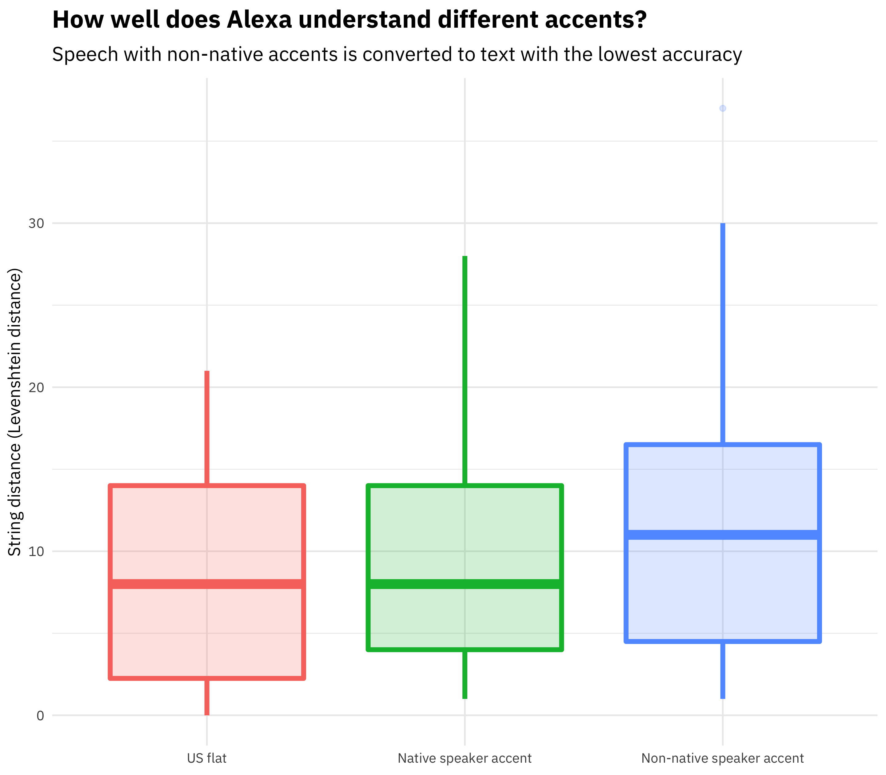

---
output:
  xaringan::moon_reader:
    css: [default, ../slides.css]
    lib_dir: libs
    nature:
      highlightStyle: github
      highlightLines: true
      countIncrementalSlides: false
---
class: middle, first-slide

.pull-left[

<b>L'Analyse de données avec</b>

]

.pull-right[

]
<h1 style="text-align:center;">Welcome `r emo::ji('raised_hands')`</h1>

  <h3><a href="http://anicet.xyz">Anicet Ebou</a></h3>

<h4 style="text-align:center;">`r format(Sys.time(), "%a %d %b %Y")`, Seminaire @ Agence Emploi Jeunes, Abidjan</h4>
---

class: center, middle, inverse

# Qu'est ce que la data science?

---

# Data Science ?

.quote[
Data science is an exciting discipline that allows you to turn raw data into understanding, insight, and knowledge.

Hadley Wickham - R for Data Science
]

--

- Il s'agit de tirer des **insights** de données brutes.

--

.instructions[
Objectif: Tirer des informations, parfois auquelles ont ne s'attends pas, des données brutes obtenues.
]
---
class: center, middle, inverse

# Des exemples...

---

# Analyse des tweets de Donald Trump

.pull-left[
"L'analyse des tweets de Trump confirme que les tweets venant reelement de lui sont colerique et viennent d'Android."

David Robinson

http://varianceexplained.org/r/trump-tweets/
]

.pull-right[

]
---

# Comment Alexa distingue les accents d'anglais?

.pull-left[
"Il y a une claire différence entre la longueur entre les mots entre les natifs et les non-natifs."

Julia Silge

https://juliasilge.com/blog/amazon-alexa/
]

.pull-right[

]
---
class: center, middle, inverse

# Petite mise en bouche

---

# Rejoignez RStudio Cloud

---

# EA - 01 AFRODS

---
class: center, middle, inverse

# Code de conduite et de participation

---

# Code de conduite et de participation

- Tous les points de vue sont les bienvenus;

--

- Tout le monde a le droit d'intervenir;

--

- Tout le monde doit faire l'effort d'être à l'heure;

--

- Eviter les propos désagréables envers ces collègues lors des sessions;

--

- Participer et faire les applications;

--

- Etre toujours souriant.

---

class: center, middle

# Fin de la premiere session !
# Merci !
<h1> `r emo::ji("clap")` </h1>