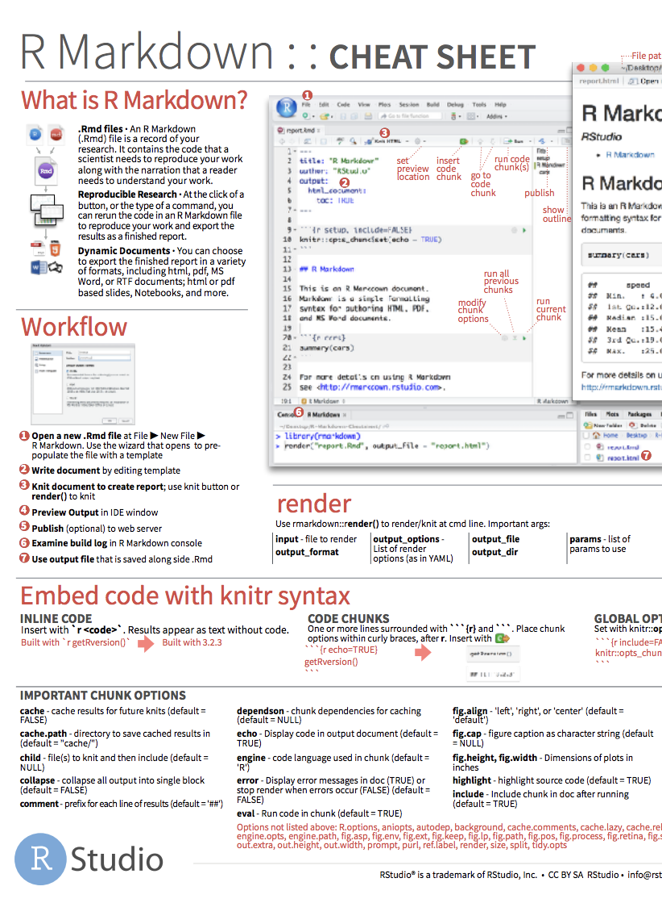

class: first-slide

<br/>
.pull-left[
<h1>L'analyse des données avec</h1>
]

.pull-right[
<br/>

]
<h1 style="text-align:center;">Les outils de travail `r emo::ji('tool')`</h1>
<h3 style="color:#162C9a; text-align:center;">Anicet Ebou</h3>
<h5 style="text-align:center;">Seminaire @ Agence Emploi Jeunes, Abidjan<br/>
2020-01-27 - 2020-01-29</h5>

---

class: center, middle, inverse

# La reproductibilité dans les analyses de données

---

## L'Analyse reproductible

.question[
Qu'est ce que c'est qu'une analyse de donnée 'reproductible' ?
]

--

A cours terme:
- Est-ce que les figures et les tableaux peuvent être reproduis à partir des codes et données disponible ?
- Est-ce que le code réagis comme on l'attends?
- Sait-on en plus **pourquoi** les choses ont été faites comme cela?

A long terme:
- Peut-on utiliser le même code pour analyser d'autres données?
- Le code peut-il être amélioré pour d'autres analyses?

---

## Les bonnes pratiques et les outils

- Utiliser les projets RStudio.
- Utiliser `r emo::ji("package")` `here` pour la gestion des chemins vers les fichiers.
- Initialiser le projet avec le gestionnaire de `r emo::ji("package")` `renv`.
- Définir les pipelines d'analyse avec `r emo::ji("package")` `drake`.
- Utiliser Git/Github pour la gestion des versions.
- Rmarkdown pour la programmation littérale.

Visitez https://annakrystalli.me/talks/r-in-repro-research-dc.html pour plus de détails.

---

## Qu'est ce que R/RStudio?

- R est un langage de programmation statistique.
- RStudio est une interface convenable pour R (IDE).
- De facon plus simple: R est comme le moteur et RStudio est comme le tableau de bord.  


.footnote[
source: ModernDive
]

---

## Un petit tour de R/RStudio

- La console.
- Utiliser R comme une calculatrice.
- Environnement.
- Charger et visualiser un tableau: programmaticallement et graphiquement.

```{r eval=FALSE}
table <- readxl::read_excel("dataframe.xlsx")
View(table)
```

Panneau environnement $\rightarrow$ import Dataset $\rightarrow$ Selectionnez le type de fichier $\rightarrow$ Selectionnez le fichier $\rightarrow$ Definissez les parametres $\rightarrow$ cliquer sur importer

---

## Un petit tour de R/RStudio

- Accéder à une variable dans un tableau: avec le symbole $.

```{r eval=FALSE}
table$var_name ou table[,numColumn]
```

- Fonctions dans R: ce sont la plupart du temps des verbes suivie de parenthèses.

```{r eval=FALSE}
fais_ceci(a_ceci)
fais_cela(a_ceci, a_cela, avec_ca)
```

- Les packages sont installés avec la fonction `install.packages()` et chargé avec la fonction `library()`:

```{r eval=FALSE}
install.packages("package_name")
library(package_name)
```
---

## Projets dans RStudio

- Les projets dans RStudio permettent de garder les codes écrits pour une analyse ainsi que les données et autre matériel ensemble dans un même dossier.
- Pour créer un nouveau projet: Fichier > Nouveau projet > Nouveau dossier.
- Les projets RStudio sont portables et indépendant entre autres.

---

## R Markdown

- Rapports entièrement reproductibles: chaque fois que vous reconstruisez le fichier, l'analyse est exécutée depuis le début.
- Une simple syntax utilisant markdown.
- Les codes vont dans les chuncks, défini par trois backticks, les textes vont à l'extérieur des chuncks.

---

## Un petit tour de R Markdown

- Ouvrir un document R Markdown.  
- Construisez vos documents.  
- R Markdown et certaines syntaxes.  
---

## R Markdown help

.pull-left[
[R Markdown cheat sheet](https://github.com/rstudio/cheatsheets/raw/master/rmarkdown-2.0.pdf)

]

.pull-right[
R Markdown Quick Reference  

Help $\rightarrow$ Markdown Quick Reference


]
---

## Workspace

Un élément essentiel duquel il faut a tout prix se rappeler: L'espace de travail du document **R Markdown** est différent de celui de la **console**.

- Lancez cette commande dans la console:

```{r eval=FALSE}
x <-2
x*4
```

.instructions[
Tout semble bien se passer n'est ce pas?
]

- Maintenant lancez cette ligne dans le R Markdown:
```{r eval=FALSE}
x*4
```

.instructions[
Qu'est ce que vous remarquez?
]

---

## Comment il faudrait utiliser R Markdown

- Chaque projet, analyse, rapport, etc devrait être redigé dans un R Markdown.
- C'est une habitude à prendre.

---

## Tidyverse

.pull-left[

]

.pull-right[
[tidyverse.org](https://tidyverse.org)

- Tidyverse est une collection de paquets R conçus pour la data science.
- Tous les packages partagent une même philosophie sous-jacente et une grammaire commune. 
]

---
## Reference

- Mine CetinkayaRundel's Data Science box course: datasciencebox.org

---
class: center, middle

## Fin de la deuxième session !
## Merci !
<h1> `r emo::ji("clap")` </h1>