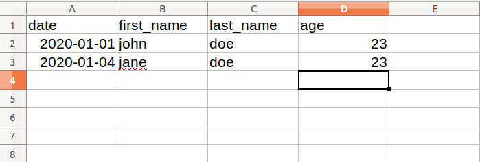

class: first-slide

<br/>
.pull-left[
<h1>L'analyse des données avec</h1>
]

.pull-right[
<br/>

]
<h2 style="text-align:center;">Importer et exporter les données `r emo::ji('file')`</h2>
<h3 style="color:#162C9a; text-align:center;">Anicet Ebou</h3>
<h5 style="text-align:center;">Seminaire @ Agence Emploi Jeunes, Abidjan<br/>
2020-01-27 - 2020-01-29</h5>
---
```{r child = "../setup.Rmd"}
```

```{r echo=FALSE, message=FALSE, warning=FALSE}
library(readr)
library(data.table)
```

class: center, middle, inverse

# Importer les données

---

## Les types de fichiers

- Les fichiers texte (Flat files): comma separated value (csv), tab separated value (tsv), etc.
- Les fichiers Excel: .xlsx ou .xls.
- Les fichiers statistiques: SAS, SPSS, STATA.
- Les bases de données: PostgreSQL, MySQL.
- Les données du Web: Scrapping.

---

## Importer les fichiers textes

Nous utiliserons les packages `readr` et `data.table` pour leur rapidité et leur consistance.

- fichier.csv avec header:  
`date,first_name,last_name,age`  
`2020-01-01,john,doe,23`  
`2020-01-02,jane,doe,25`  
...  

```{r eval=FALSE}
file_name <- readr::read_csv("lien/vers/fichier.csv")
```

- fichier.csv sans header:  
`2020-01-01,john,doe,23`  
`2020-01-02,jane,doe,25`  
... 

```{r eval=FALSE}
file_name <- readr::read_csv("lien/vers/fichier.csv", col_names = FALSE)
```
---

## Importer les fichiers textes

- fichier.tsv avec header:  
`date\tfirst_name\tlast_name\tage`  
`2020-01-01\tjohn\tdoe\t23`  
`2020-01-02\tjane\tdoe\t25`  
...  

```{r eval=FALSE}
file_name <- readr::read_tsv("lien/vers/fichier.csv")
```

- fichier.tsv sans header:  
`2020-01-01\tjohn\tdoe\t23`  
`2020-01-02\tjane\tdoe\t25`  
... 

```{r eval=FALSE}
file_name <- readr::read_tsv("lien/vers/fichier.csv", col_names = FALSE)
```
---


## Importer les fichiers textes

La fonction `fread()` du package data.table détecte immédiatement le format du fichier et la présence ou non d'entête.

- fichier.csv (fichier.tsv) avec header:  
`date,first_name,last_name,age`  
`2020-01-01,john,doe,23`  
`2020-01-02,jane,doe,25`  
...  

```{r eval=FALSE}
file_name <- data.table::fread("lien/vers/fichier.csv")
```

- fichier.csv (fichier.tsv) sans header:  
`2020-01-01,john,doe,23`  
`2020-01-02,jane,doe,25`  
... 

```{r eval=FALSE}
file_name <- data.table::fread("lien/vers/fichier.csv")
```
---

## Importer les fichiers Excel

Si vous entrez vos données dans Excel avant de les importer dans R alors faites un fichier excel sans grand style pour l'importation. Nous utiliserons le package `readxl`.
  

  
```{r eval=FALSE}
# pour les fichiers xlsx
file_name <- read_xlsx("lien/vers/fichier.xlsx")

# pour les fichiers xls
file_name <- read_xls("lien/vers/fichier.xls")

# si on n'est pas trop sur
file_name <- read_excel("lien/vers/fichier.xlsx")
```
---

class: center, middle, inverse

# Exporter les données

---

## Exporter les données

```{r eval=FALSE}
# Exporter en csv
write_csv(objet, "fichier_export.csv")

# Exporter en tsv
write_tsv(objet, "fichier_export.tsv")

# Convertir un fichier csv en excel
write_excel_csv(objet, "fichier_export.xlsx")
```

---

## Les autres types de fichiers

- Le package **haven**  permet d'importer les fichiers de SPSS, SAS, STATA.
- Le package **DBI** permet de communiquer avec les bases de donnees.
- Le package **jsonlite** pour les fichiers json.
- Le package **xml2** pour les fichiers xml

---
class: center, middle

# Fin de la première session !
## Jour 2
# Merci !
<h1> `r emo::ji("clap")` </h1>