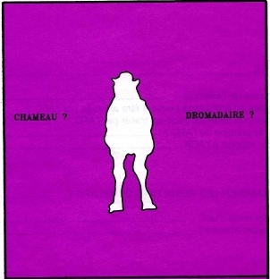
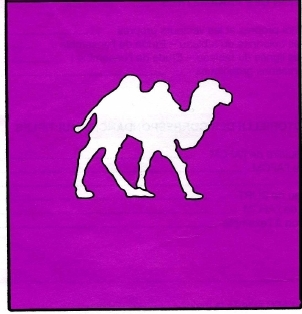

class: first-slide

<br/>
.pull-left[
<h1>L'analyse des données avec</h1>
]

.pull-right[
<br/>

]
<h2 style="text-align:center;">Analyse multivariée `r emo::ji('multitask')`</h2>
<h3 style="color:#162C9a; text-align:center;">Anicet Ebou</h3>
<h5 style="text-align:center;">Seminaire @ Agence Emploi Jeunes, Abidjan<br/>
2020-01-27 - 2020-01-29</h5>
---
class: center

```{r child = "../setup.Rmd"}
```

```{r echo=FALSE, message=FALSE, warning=FALSE}
library(tidyverse)
```

## Qu'est-ce qu'une analyse multivariée?



---

class: center
## Qu'est-ce qu'une analyse multivariée?



.footnote[
Illustration extraite de «Qu’est-ce que l’analyse des données?»
PENELON J. P. 1981 - LEFONEN Paris
]

---

## Objectifs des analyses multivariées

**Analyser simulaténament** les données dans leur ensemble, en prenant en compte toutes les variables.

- Pour décrire et synthétiser: ACP, AFC, AFCM
- Pour classifier c'est à dire regrouper les individus par la classification automatique et la typologie: CAH
- Pour expliquer: regression multiple et AFD

---

class: middle, center, inverse

# Méthodes de description

---

## Analyse en composantes principales (ACP)

- But: mettre en évidence des similarités ou des oppositions entre variables et à repérer les variables les plus corrélées entre elles.
- Intérêt: fournir une méthode de représentation (structuration) d'une population décrite par un ensemble de caractères.
- Les modalités sont **quantitatives** (continues).

---

## Application 03 - Snail proteins

- Ouvrez le projet snail proteins
- Ouvrez le fichier snail-proteins-project.Rmd, changez le nom de l'auteur et compilez le document (knit)

---

## Analyse en composantes principales (ACP)

```{r, message=FALSE}
# libs ----------
library(factoextra)

# import data ---
snail <- readxl::read_excel("./data/snail.xlsx")
snail2 <- snail[,-1]

# perform pca ---
res.pca <- prcomp(snail2, scale = TRUE)

# show result ---
summary(res.pca)
```
---

Les individus avec un profile similaire sont groupés ensemble.

```{r}
fviz_pca_ind(res.pca,
             col.ind = "cos2",
             gradient.cols = c("#00AFBB", "#E7B800", "#FC4E07"), repel = TRUE)
```

---

Les variables correlées positivement pointent du même côté du graphique, les variables correlée négativement pointent dans le sens inverse.

```{r}
fviz_pca_var(res.pca, col.var = "contrib", 
             gradient.cols = c("#00AFBB", "#E7B800", "#FC4E07"), repel = TRUE)
```

---

## Analyse factorielle des correspondances (AFC)

- But: décrire sous forme graphique le maximum de l'information contenu dans un tableau de contingence.
- Intérêt: décrire la dépendance ou la concordance entre deux ensembles de caractères.
- Les deux variables sont **qualitatives**, l'une ayant ses modalités en lignes et l'autre ses modalités en colonnes.

---

```{r output.lines=15}
library(FactoMineR)

diamonds2 <- diamonds %>% select(cut, clarity)

diamonds2 <- table(diamonds2)

res.afc <- CA(diamonds2, graph = FALSE)

head(res.afc)
```

---

```{r}
fviz_screeplot(res.afc, addlabels = TRUE)
```

---

```{r}
fviz_ca_biplot(res.afc, repel = TRUE)
```

---

## Analyse (factorielle) des composantes multiples (ACM)

```{r , eval=FALSE}
data(tea)

tea2 <- tea %>% select(breakfast, tea.time, always, work, tearoom, How, sugar)

res.mca <- MCA(tea2)

fviz_mca_var(res.mca, col.var = "contrib",
             gradient.cols = c("#00AFBB", "#E7B800", "#FC4E07"), 
             repel = TRUE, # avoid text overlapping (slow)
             ggtheme = theme_minimal())

```

---

class: middle, center, inverse

# Méthodes de classification

---

## Classification ascendante hiérarchique (CAH)

- But: exploiter les données numériques d'un tableau pour **classer** les individus représentés dans ce tableau en des groupes constitués chacun d'éléments assez homogènes.
- Le tableau est souvent representé sous forme de dendogramme.
- Intérêt: donner une idée du nombre de classes existant effectivement dans la population.
- La méthode est basée sur la détermination d'un critère de ressemblance entre les individus (**type de distance**) et la détermination d'un critère d'aggrégation des classes (**type d'algorithme**).

---

```{r fig.height=2.8, fig.width=7}
# data normalization
USArrests <- scale(USArrests)

# dissimilarity matrix
d <- dist(USArrests, method = "euclidean")

# hierarchical clustering using complete linkage
hc <- hclust(d, method = "complete")

plot(hc, cex = 0.4)

rect.hclust(hc, k = 4, border = 2:5)
```

---

```{r fig.height=4.2, fig.width=7}

# cut tree into 4 groups
usa_grp <- cutree(hc, k = 4)

# Draw the result in scatter plot
fviz_cluster(list(data = USArrests, cluster = usa_grp))
```
---

## Analyse factorielle - classification

Cette méthode permet de combiner plusieurs méthodes d'analyse multivariée en une à la fois: 
les analyses en composantes principales (ACP, AFC, ACM) et les méthodes de classification (CAH, K-means).

- Variables quantitatives: ACP $\rightarrow$ classification
- Variables qualitatives: AFC $\rightarrow$ classification

---

```{r}
# compute PCA with ncp = 3
res.pca <- PCA(USArrests, ncp = 3, graph = FALSE)

# compute hierarchical clustering on principal components
res.hcpc <- HCPC(res.pca, graph = FALSE)

summary(res.hcpc)
```

---

```{r}
fviz_dend(res.hcpc, cex = 0.5, 
          palette = "jco", rect = TRUE, 
          rect_fill = TRUE, rect_border = "jco", 
          labels_track_height = 0.8)
```

---

```{r fig.height=4.5, fig.width=7}
fviz_cluster(res.hcpc, repel = TRUE,
             show.clust.cent = TRUE, palette = "jco", 
             ggtheme = theme_minimal())
```

---

class: center, middle

# Fin de la troisieme session !
## Jour 2
# Merci !
<h1> `r emo::ji("clap")` </h1>